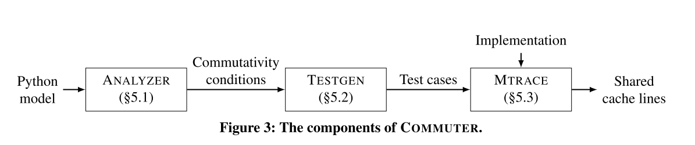

# The Scalable Commutativity Rule: Designing Scalable Software for Multicore Processors

## 背景介绍

在传统的软件设计领域，评价一个软件的可扩展性，通常是从软件设计的架构来考虑。但是本篇文章中作者认为操作具有交换性的接口，是可以实现为可扩展的。由此作者们提出了新的观点：可扩展性不应当被理解成一种软件实现的特性，而应当理解成一种软件接口设计的特性。也就是说，软件的可扩展性应当从接口的设计时就开始考量，而不应当等到实现时再去优化。例如，POSIX文件系统中的文件创建，并不是一个可扩展的接口。因为当多个进程同时在同一个目录下创建文件时，必须序列化的访问目录。

本文围绕如何设计一个可扩展的API来论述，并设计了一个名为commuter的工具，可以对接口的模型进行形式化的分析。在作者看来，新的实现软件可扩展性设计的方法是，先设计接口的模型，通过工具分析证明其commutativity，然后再根据模型去实现具体的接口代码。

## 可扩展性规则

SIM交换性规则：如果在一个线程中交换了两个操作，并不影响它们得出的结果，则称这两个操作为可交换的。论文中证明了如果两个操作可以交换，则这个操作一定存在一种没有冲突的，可扩展性的实现。

当考虑接口的SIM交换规则时，要求对于一系列的接口调用操作，对于操作的不同排序实现，其效果都是一样的，从结果来看是不可区分的。文章对交换规则进行了证明。

可扩展性规则：如果操作是可以交换的，那么这就意味着我们使用接口来区分操作的执行顺序，也就意味着存在一种可扩展的方式来实现这些操作。一般的，如果一组操作在内存访问上是没有冲突的，我们就认为这组操作时可扩展的。

## 设计可扩展的接口

上述的规则有助于帮助开发者推理如何设计出可扩展性的接口。在实际的设计中，设计可扩展性接口有以下几个策略：

- 分解复合的操作。许多POSIX API将多个操作合并为一个操作，限制了组合操作的交换性，从而降低了接口设计的扩展性。例如，fork操作创建一个新进程并为当前进程的整个内存状态创建一个快照，包括文件描述符状态、信号掩码和一些其他的属性。由此引入的问题是，fork不能在同一进程中执行大多数其他操作，例如内存写入，地址空间操作和文件描述符操作等。然而，应用程序经常会跟随exec执行fork操作，这会解除fork的大部分子操作。只有fork和exec，应用程序被迫接受这些限制交换性的不必要的子操作，不仅引入很大的冗余，也降低了可扩展性。
- 去掉接口中的一些并不需要的功能，这些功能往往因为引入了约束而降低了可扩展性，比如POSIX的返回最小的可用的FD
- 弱化不必要的排序约束。严格的排序会降低交换性，从而限制可扩展性。一些接口设计中要求的操作排序是没有必要的，应该去掉这些排序约束
- 异步释放资源，不用要求在函数返回时立即释放

## 使用COMMUTER分析接口

准确并充分地理解接口的交换性并加以证明和验证是很复杂的，而如果对规则进行形式化描述，则可以使用程序来自动化完成大部分的推理。因此，作者设计了COMMUTER工具，用于自动化分析接口的可扩展性。工具主要有三个模块：

- ANALYZER:自动分析接口的复杂性，给出一个交换条件，从而使开发人员免于考虑复杂操作之间的大量数据交互过程，这个过程往往是繁琐且容易出错的。
- TESTGEN：用于从ANALYZER给出的交换条件中生成大量的测试用例。虽然开发人员可以直接检查ANALYZER产生的交换性条件，但对于复杂的接口，这些公式的检查可能比较困难。此外，即使开发人员了解接口的交换性，实际实现测试用例也很复杂，因此需要这个模块来进行测试用例的生成。
- MTRACE：MTRACE将TESTGEN生成的测试用例运行在实际的系统上，并检查每个测试的实现是否无冲突。

