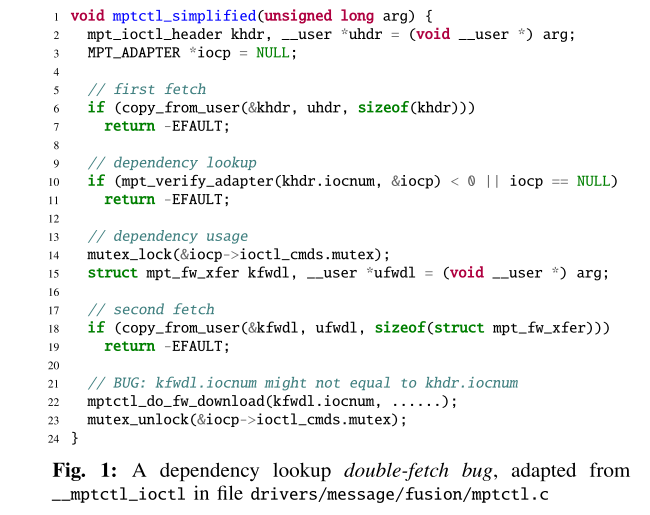
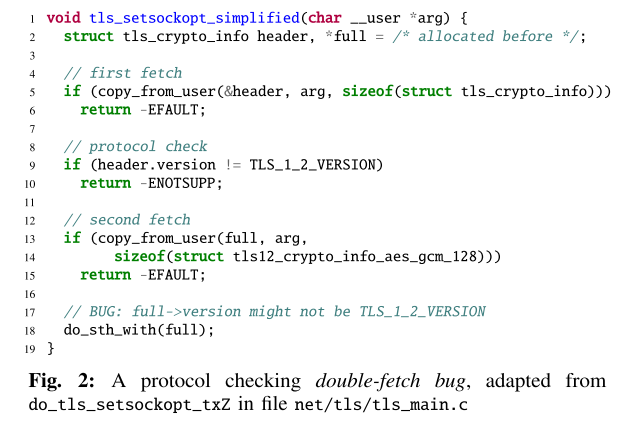
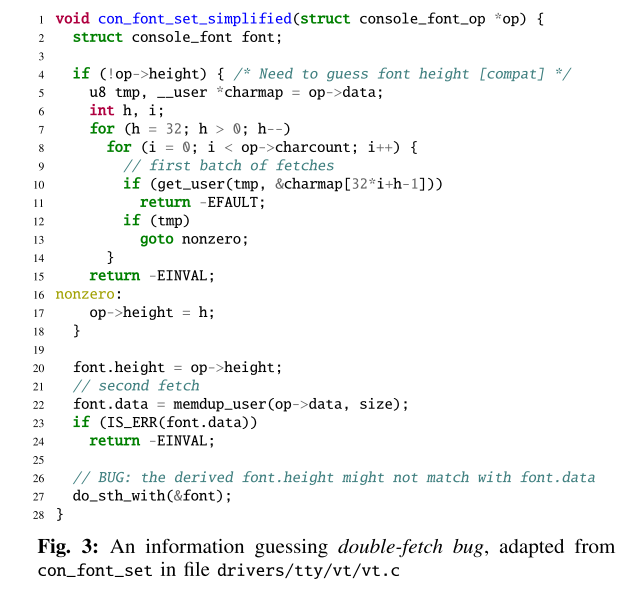
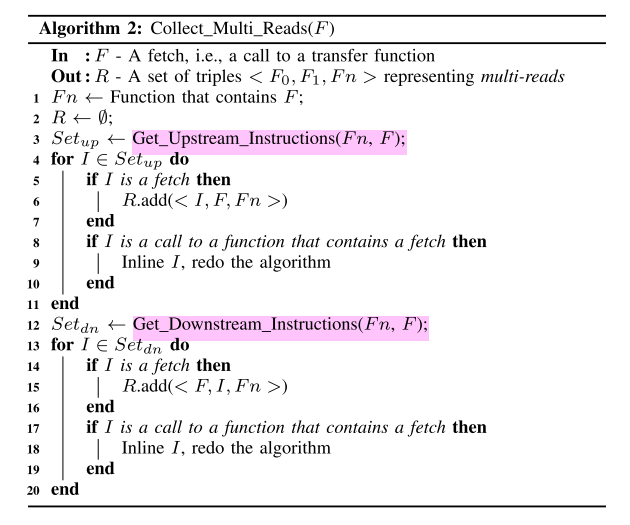
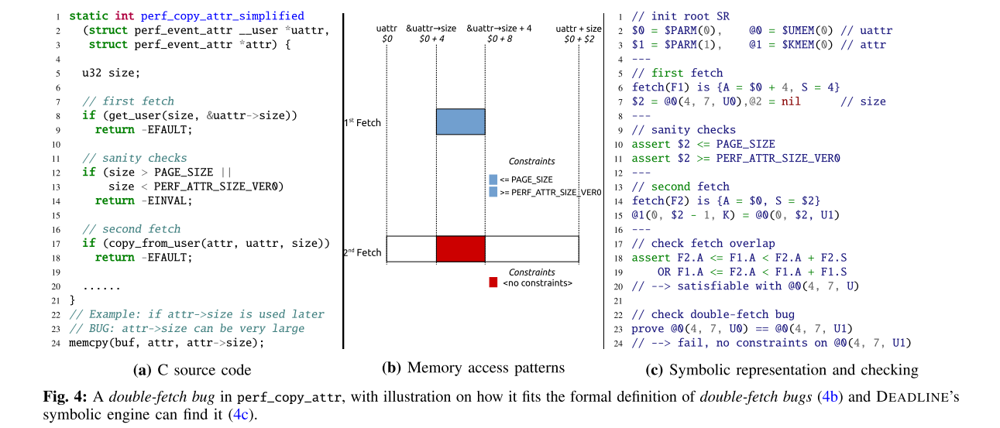

# Precise and Scalable Detection of Double-Fetch Bugs in OS Kernels

操作系统的内核在系统调用的执行期间可能多次读取同一块用户空间的内存，若两次次读取之间用户空间内存中的内存发生了变化，则可能导致double-fetch这种bug。之前的很多工作尝试通过静态或动态的方法来检测这种bug，然而由于对double-fetch定义不清晰，这些工作在检测的本质上就存在一定缺陷，从而导致大量的漏报和误报。

本文首先对double-fetch进行了正式和精确的定义，并设计了静态分析工具DEADLINE来自动化探测linux kernal中的double-fetch错误。工具发现了Linux系统中的23个新bug。

## 背景介绍

内核是操作系统的重要区域，一旦发生bug将造成很严重的危害。目前有很多工作针对内核中的bug进行探测和防御，但是大部分对于逻辑漏洞无能为力。double-fetch就是一类重要的逻辑漏洞，曾经有攻击者利用windows中的此类漏洞来进行提权。double-fetch的前提是double-reads，而内核中由于多线程多次读取一块空间而导致double-reds的情况普遍存在。例如，内核需要从用户空间读取一块最大长度为4kb的变长数据时，会预先分配一个4kb的缓冲区，并一次性从用户空间读取4kb长度的数据。然而，大多数情况下有效数据的长度只有64字节或是更少，此时出于优化的考虑，内核会先读取4字节的数据，之后再分配缓冲区大小并读取字节粒度的数据。

对于Linux系统而言，正常运行时内核中存在上千个multi-reads的情况，但不一定都是double-fetch而产生错误。那如何进行合理的判断呢？之前的方法主要是人工审计可能存在这些问题的代码，因此十分的低效。因此本文设计了一个名为DEADLINE的工具，用于通过静态分析来自动化检测double-fetch这种bug，并具有很高的检测精度和覆盖率。

### 地址空间划分

在现代操作系统中，虚拟内存分为用户空间和内核空间区域。用户空间区域对于系统中运行的每个进程都是分开的，因此每一个程序都可以看到一块自己的内存空间。程序的用户空间地址可以被该程序下的所有线程以及系统的内核进程所访问；而内核空间区域是只有内核才可以访问的。此外，虽然内核可以访问用户空间地址，但是出于安全性和隔离性的考虑，内核不会直接读取用户空间地址或者直接解引用用户地址空间的指针，而是采用系统单独设计的拷贝函数来将数据从用户空间拷贝到内核空间使用，例如Linux中的copy_from_user，get_user和FreeBSD中的copyin，fuword。这些方案不仅会进行数据传输，还主动验证用户空间访问的正确性，并处理非法地址或页面错误等异常。

### multi-reads的普遍性

出于性能的考虑，内核进程在从用户地址空间拷贝数据时，一般不会直接进行数据拷贝。更常见的操作是，先从用户空间读取需要拷贝数据的大小（size），进行校验之后，再使用该大小分配特定的缓冲区大小，并从用户空间去拷贝size大小的数据，因此会发生至少两次fetch操作。通常，这两种fetch操作会有一定的关联，而size只是其中的一种情况。作者总结，两次fetch操作的数据通常有以下关系：
- 依赖查找：对于一次数据读取请求，可能有多个对应的处理函数。内核先从用户空间拷贝一些特征信息，判断即将读取的数据类型，并查找应该使用哪个对应的处理函数，判断之后进行第二次读取。示例如图所示。

- 协议/签名校验：第一次读操作先读取特定的协议版本号或消息签名，内核校验通过后再进行下一次读取。

- 信息猜测：如果缺乏数据的具体位置信息，内核可能通过使用循环来多次读取，尝试找到有效的数据位置，然后再使用一次读取从用户空间拷贝完整数据。

## 形式化定义double-fetch

为了便于后续使用程序来查找double-fetch错误，论文首先对这种错误进行了形式化的定义。作者认为，double-fetch的确认过程必须经过以下的四个步骤：
1. 至少有两次对用户空间的读操作，即double-fetch的前提是multi-reads。这一点可以通过扫描代码中的copy_from_user()函数来确定；
2. 两次读取的内容必须要有重叠部分，才可能发生错误。进一步来说，这个multi-reads必须是一个overlapped-fetch；
3. 两次读取的数据必须要有一定的关联，可以是数据以来或者控制依赖；
4. 两次读取的重叠部分不能被证明在两次不同的读取中一定是相同的，也就是说用户空间可能因为条件竞争而在两次读取之间改变了这个区域的值。

论文中对上述的几个定义都进行了符号化的表述。

## 系统设计

### 概述

DEADLINE使用符号执行来对内核代码进行静态符号检查以确定double-fetch错误。符号执行在LLVM IR的层次上进行，前人的工作也表明了在IR层面进行符号执行相比于源码来说有诸多的好处。整个工具的运行流程如下图的伪代码算法，即首先扫描内核所有的代码，收集所有的multi-reads情况，并对每一组有关联的multi-reads执行符号执行检查，判断是否会导致double-fetch错误，如果是，则将其加入输出集合。

### 发现multi-reads

分为两个步骤，对应着两个处理过程

1. Collect_Multi_Reads(F)

    > 扫描内核中所有的fetch操作，将相关联的两次读取保存进一个<F0,F1,Fn >的元祖，将这个元祖存入结果集合。
    

2. Construct_Execution_Paths(F0, F1, Fn)

    > 这个函数有两个作用，第一是确定两个fetch操作F0和F1之间的所有路径，通过遍历CFG即可得到；第二是找到两次fetch中的可能导致double-fetch的关键数据，即第一次fetch并可能影响到路径信息的数据。

### 从multi-reads到double-fetch

与常规的符号执行不同在于，传统的符号执行在处理内存读写时，若两次读取同一位置的操作之间没有内存的写操作，则假设从同一位置读取的值都是一样的。但这个模型在当前的环境中显然是不适用的，否则就找不到double-fetch错误了。为了解决这个问题，DEADLINE采取的方法是对每一次的内存读取进行编号，以表示两次读取的内容可以不同。

最后，使用Z3来求解约束，看是否满足形式化定义中提出的四个条件，从而求解是否存在double-fetch。

最后，作者给出了一个完整的案例分析，如图所示。

