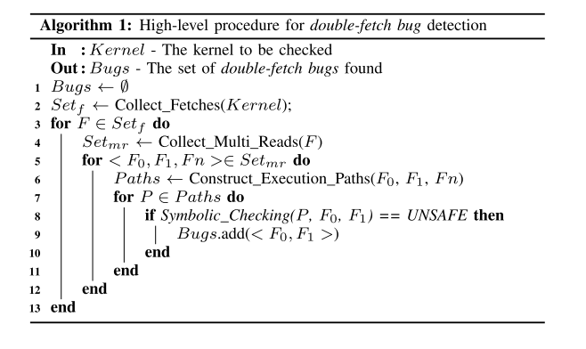

# Precise and Scalable Detection of Double-Fetch Bugs in OS Kernels

操作系统的内核在系统调用的执行期间可能多次读取同一块用户空间的内存，若两次读取之间用户空间中的数据发生了变化，则可能导致double-fetch这种bug。之前的很多工作尝试通过静态或动态的方法来检测这种bug，然而由于对double-fetch定义不清晰，这些工作会导致大量的漏报和误报，还需要引入大量的人工分析。

本文首先对double-fetch进行了正式和精确的定义，并设计了静态分析工具DEADLINE来自动化探测linux kernal中的double-fetch错误。工具发现了Linux系统中的23个新bug和freeBSD的1个新bug。

## 背景介绍

内核是操作系统的重要区域，一旦发生bug将造成很严重的危害。目前有很多工作针对内核中的bug进行探测和防御，但是大部分对于逻辑漏洞无能为力。double-fetch就是一类重要的逻辑漏洞，曾经有攻击者利用windows中的此类漏洞来进行提权。double-fetch的前提是multi-reads，而内核中由于多次读取同一块空间而导致double-reads的情况普遍存在。例如，内核需要从用户空间读取一块最大长度为4kb的变长数据时，可能会预先分配一个4kb的缓冲区，并一次性从用户空间读取4kb长度的数据。然而，大多数情况下有效数据的长度只有64字节或是更少，此时出于优化的考虑，内核会先从用户空间读取数据的长度信息，之后再分配缓冲区大小并读取数据。

对于Linux系统而言，正常运行时内核中存在上千个multi-reads的情况，但不一定都是double-fetch而产生错误。那如何进行合理的判断呢？之前的方法主要是人工审计可能存在这些问题的代码，因此十分的低效。本文设计了一个名为DEADLINE的工具，用于通过静态分析来自动化检测double-fetch这种bug，并具有很高的检测精度和覆盖率。

### 地址空间划分

在现代操作系统中，虚拟内存分为用户空间和内核空间区域。用户空间区域对于系统中运行的每个进程都是分开的，因此每一个程序都可以看到一块自己的内存空间。程序的用户空间地址可以被该程序下的所有线程以及系统的内核进程所访问；而内核空间区域是只有内核才可以访问的。此外，虽然内核可以访问用户空间地址，但是出于安全性和隔离性的考虑，内核不会直接读取用户空间地址或者直接解引用用户地址空间的指针，而是采用系统单独设计的拷贝函数来将数据从用户空间拷贝到内核空间使用，例如Linux中的copy_from_user，get_user和FreeBSD中的copyin，fuword。这些方案不仅会进行数据传输，还主动验证用户空间访问的正确性，并处理非法地址或页面错误等异常。

### multi-reads的普遍性

出于性能的考虑，内核进程在从用户地址空间拷贝数据时，一般不会直接进行数据拷贝。更常见的操作是，先从用户空间读取需要拷贝数据的大小（size），进行校验之后，再使用该大小分配特定的缓冲区大小，并从用户空间去拷贝size大小的数据，因此会发生至少两次fetch操作。通常，这两种fetch操作会有一定的关联，而size只是其中的一种情况。作者总结，两次fetch操作的数据通常有以下关系：

- 依赖查找：对于一次数据读取请求，可能有多个对应的处理函数。内核先从用户空间拷贝一些特征信息，判断即将读取的数据类型，并查找应该使用哪个对应的处理函数，判断之后进行第二次读取。示例如图所示。

- 协议/签名校验：第一次读操作先读取特定的协议版本号或消息签名，内核校验通过后再进行下一次读取。

- 信息猜测：如果缺乏数据的具体位置信息，内核可能通过使用循环来多次读取，尝试找到有效的数据位置，然后再使用一次读取从用户空间拷贝完整数据。

## 形式化定义double-fetch

为了便于后续使用程序来查找double-fetch错误，论文首先对这种错误进行了形式化的定义。作者认为，double-fetch的确认过程必须经过以下的四个步骤：

1. 至少有两次对用户空间的读操作，即double-fetch的前提是multi-reads。这一点可以通过扫描代码中的copy_from_user()函数来确定；
2. 两次读取的内容必须要有重叠部分，才可能发生错误。进一步来说，这个multi-reads必须是一个overlapped-fetch；
3. 两次读取的数据必须要有一定的关联，可以是数据依赖或者控制依赖；
4. 两次读取的重叠部分不能被证明在两次不同的读取中一定是相同的，也就是说用户空间可能因为条件竞争而在两次读取之间改变了这个区域的值。

论文中对上述的几个定义都进行了符号化的表述。

## 系统设计

### 概述

DEADLINE使用符号执行来对内核代码进行静态符号检查以确定double-fetch错误。符号执行在LLVM IR的层次上进行，前人的工作也表明了在IR层面进行符号执行相比于源码来说有诸多的好处。整个工具的运行流程如下图的伪代码算法，即首先扫描内核所有的代码，收集所有的multi-reads情况，并对每一组有关联的multi-reads执行符号执行检查，判断是否会导致double-fetch错误，如果是，则将其加入输出集合。

### 寻找multi-reads

如何找到内核中所有的multi-reads情况呢？作者选取的方式是，首先扫描内核代码，通过识别代码中的copy_from_user等读取用户空间数据的函数来找到所有的fetch操作，其次对于每个fetch操作所在的函数，进行函数内的自底向上分析，以找到一个fetch pair。如果找到了一个fetch pair，则说明找到了一个multi-reads情况，并将其用一个三元组<F0,F1,Fn >。在这个三元组中，F0和F1分别表示两次fetch指令的位置，Fn表示这两条指令所在的函数名称。函数自底向上分析的过程如图所示，从fetch操作所在函数的底部开始，自底向上分析指令，当出现第二次fetch的时候，就可以认定为一个fetch pair并生成三元组。如果在分析的过程中遇到了带有fetch操作的函数，则会将这个函数代码内联进来进行分析。

### 从multi-reads到double-fetch

之前的一些论文中的工具主要止步于找到内核中的multi-reads情况，之后采用人工分析来从中确定double-fetch的bug，需要耗费大量的人力。本文设计的工具在发现multi-reads之后，将继续使用符号执行来进行静态分析，以发现真正可能导致double-fetch错误的代码。

与常规的符号执行不同在于，传统的符号执行在处理内存读写时，若两次读取同一位置的操作之间没有内存的写操作，则假设从同一位置读取的值都是一样的。但这个模型在当前的环境中显然是不适用的，否则就找不到double-fetch错误了。为了解决这个问题，DEADLINE采取的方法是对每一次的内存读取进行编号，以表示两次读取的内容可以不同。

最后，使用符号执行构建约束之后对约束进行求解，看是否满足形式化定义中提出的四个条件，从而求解是否存在double-fetch。

作者给出了一个完整的案例分析，如图所示。整个符号分析的过程，首先对函数参数和全局变量进行符号化，作为根SR（symbolic representation），之后对指令进行符号化表述。符号化的过程中，对于一次fetch操作，使用一个{A,S}对来表示本次操作的属性，其中A表示读取数据的地址，S表述数据的大小。遇到与fetch数据相关的分支判断，则将其转化为assert断言作为条件约束之一。两次fetch之后，使用前述对double-fetch的形式化定义来设置约束并求解：即先判断两次所读取的数据是否有重叠，再判断是否可以证明两次读取的数据重叠部分是相等的。在这个案例中，由于两次读取分别被标识为U0和U1，且没有约束证明两者是相等的，故约束求解失败，DEADLINE给出结果，即此处存在double-fetch错误。

## 实现

作者采用LLVM对内核进行编译为IR，再将IR转换为SR进行符号执行并构建约束，最后使用Z3进行约束求解。在实现章节，作者谈到了两个技巧：

- 最大化代码覆盖率。为了最大化能测试到的代码覆盖率，作者尝试对代码中的宏定义进行尽可能的展开编译。
- 使用LLVM进行编译。使用LLVVM编译主要是为了方便使用IR进行后续的CFG构建和符号分析。由于Linux Kernal对LLVM编译十分不友好，作者采取的策略是首先使用GCC对内核代码进行编译，并将编译日志记录下来，用于LLVM的编译。但是仍然存在少数的文件无法通过编译。

## 发现

DEADLINE在Linux和freeBSD中分别发现了1104处和101处multi-reads的情况。这样的结果不仅能说明multi-reads的情况在kernal中十分普遍，更重要的是，这样的工作量如果进行人工验证需要耗费大量的精力，这也再次体现了自动化从其中寻找处double-fetch的重要性。

最后，作者在Linux和freeBSD中分别发现了23个和1个新的double-fetch bud。这些bug中的一些已经与开发者进行沟通并修补，但是仍然有两个被开发者标注为“won't fix”，关于这一点的具体原因将在后面的“局限性”章节进行展开。

## 缓解措施

作者通过与开发者交流bug修复的过程，总结了一些关于double-fetch的缓解措施：

- 重写：对于第二次fetch的数据中重叠部分，使用第一次fetch时读取的数据对其进行覆盖；
- 检测到变化则中止：如果检测到两次fetch数据不一致，则中止接下来的操作；
- 增量读取：第二次fetch时，将跳过第一次fetch过的数据，以避免读取重复数据；
- 重构为singal-fetch：如果是控制依赖，则可以一次fetch所有的数据。

当然上述的措施并不能修补所有的bug，针对一些复杂的情况还得单独进行处理。

## 局限性

作者从以下几个方面讨论了DEADLINE的一些局限性：

- 代码覆盖率：作者使用LLVM对内核进行编译，但对于没有编译成功的文件和没有展开的宏代码，将不会被测试覆盖；
- 关于路径构建的限制，有几种情况：一是在函数内构建路径时，限制了最大的路径数（4096），如果两次读取跨越了这个路径长度限制，则无法进行分析；二是循环展开时仅展开一重循环，背后的假设是循环中的提取通常是增量进行的，但这个假设不一定成立，可能出现跨循环导致的double-fetch；如果循环中有分支，仅会处理一重循环中的分支路径，这种情况也是有路径遗漏的。
- 符号检查可能存在的问题：一是工具选择忽略了内联函数，假设其对符号执行没有影响，且内核库函数是手工编写库函数的符号规则，可能不准确；二是对于指针解引用采取的策略是“任何不能确定对象的指针”都视为新的地址，可能存在误差；三是将约束检查限制在封闭函数内，但是两次读取的值可能都被传出函数，并在函数外进行检查，这种情况就会出现误报。

## 总结

首先，本文对内核中存在的double-fetch错误进行了精确和形式化的定义，从形式化角度明确区分了multi-reads和double-fetch的区别。接着，作者开发了检测工具DEADLINE，可以通过符号执行的静态分析方法对内核代码中的double-fetch错误进行自动化检测，并在Linux Kernal和freeBSD中分别发现了23个和1个新的bug。最后，文章进一步讨论了double-fetch的危害、缓解措施以及DEADLINE的一些局限性。