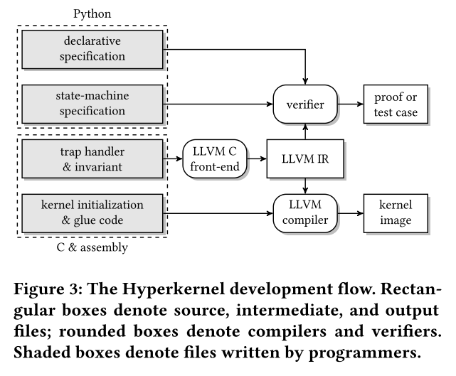
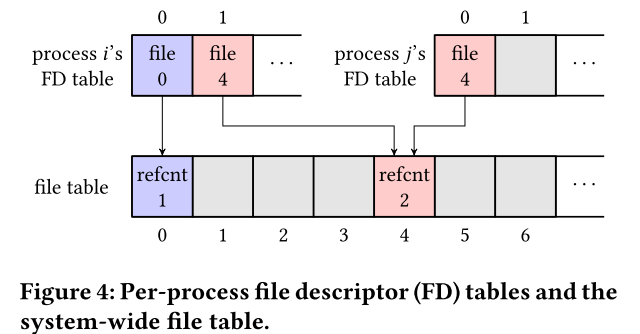

# Hyperkernel: Push-Buton Verification of an OS Kernel

## 背景介绍

内核是计算机系统中最关键的组件之一，它为用户应用程序提供了基本的运行环境和服务支持。例如，内核强制进程之间的隔离机制可以让多个应用程序安全地共享CPU、内存等资源。因此，内核中的错误会严重影响正确性和安全性，从而导致单个应用程序中的错误行为，从而导致恶意应用程序破坏整个系统。因此，如何设计一个可以被证明“正确”的系统显得尤为重要。

证明一个系统设计正确性的方法主要是靠形式化证明，这方面有很多前述的研究，UCLA Secure Unix、PSOS、KIT、VFasico、seL4d等都是经过形式化验证的系统内核。然而之前研究的一个最大问题是，内核有大量的复杂函数和接口，将形式化证明运用于内核不仅需要耗费大量的人力，而且对于人员的素养要求很高。本文所解决的问题就是，如何开发一个工具，可以高度自动化地验证系统内核的正确性，并提高验证的效率。

设计这样一个自动化工具面临着三大挑战：

1. 工具的设计需要在设计难度可用性以及自动化证明之间进行折中；
2. 在虚拟内存管理上，如何分离内存中的用户空间与内核空间，以便简化证明中的内存管理。内核中由于虚拟内存机制的存在，导致物理内存和虚拟内存并不是单射的关系，一处地址对应多出引用，难以管理，需要尽量的消除；
3. C语言编写的代码存在指针运算，内存访问等，这些都是一些底层的行为，将会使得推理变得非常复杂。如何对C语言代码进行建模就是一个棘手的问题。

作者通过在xv6系统上进行修改，重新设计了xv6的内核接口，编写交互式定理证明以让其适用于约束求解，由此产生Hyperkernal。之后通过Z3约束求解器对Hyperkernal进行了验证，发现hyperkernal可以避免原来xv6中的一些已知错误。

## 系统设计

系统的基础架构如图所示，主要包含两种形式的规范，以描述内核接口设计的正确性：

1. 确保功能正确性的详细规范；
2. 确保更便于人工审查的高层次规范。

为了保证与Z3的正常交互以及编写的便捷，上述的两个规范均采用python来实现。系统调用部分使用C来实现，并会被编译为LLVM IR的形式来进行验证。本文的设计依赖于两个假设：

- 内核运行在禁用终端的单核处理器上，因此每个系统调用都是原子的；
- 内核使用虚拟内存管理，但是和用户地址空间彼此独立。

### 有限的接口

如何设计一个有限的接口？作者这里给出了一个例子如图所示。在传统的unix系统中，文件描述符的分配规则是，每次选择一个可用的最小编号用于分配。但是这样带来的一个问题是，这个编号的获取需要通过搜索，且没有一个最小常数限制，而且可能随着FD的大小和文件状态而变化，这意味着验证的过程会因为FD表的长度而不同，因此并不是一个有限的接口。接口的修改改为dup(oldfd,newfd)，这个newfd由用户调用时自行指定。

设计一个有限接口的三个准则：

1. 强制资源被引用的生命周期；
2. 强制进行细粒度的保护；
3. 验证链接资源的结构。

### 规范

在有限接口的前提下，通过设计状态机规范来描述期望的内核行为，这个规范可以分为以下两种：

- 抽象的内核状态：内核中较为抽象的状态，用固定宽度的整数和map来定义；
- 声明的规范：高级层次的声明规范，以fd为例，记录每一个文件被引用的数量所需要满足的规范就属于这个规范的范畴层次。

状态转换规范：验证系统调用参数，并在验证通过时将系统切换到下一个状态。

### 验证

给出了两个定理：

- 内核实现是状态机规范的精炼，作者将状态机规范和实现都转换为可以用SMT验证的模式，并检查在每一步转换时，是否按照状态机进行
- 状态机规范满足声明规范，即每一次状态转换后是否满足声明

根据这样的定理，可以找到实现中的bug和状态机设计中违反声明的bug
