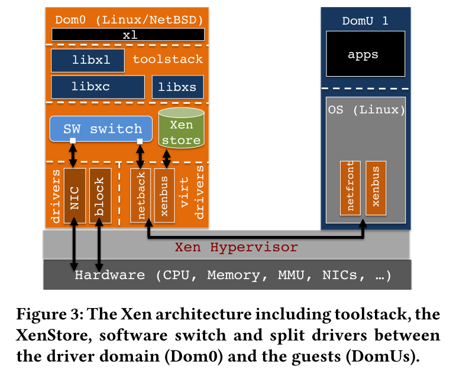
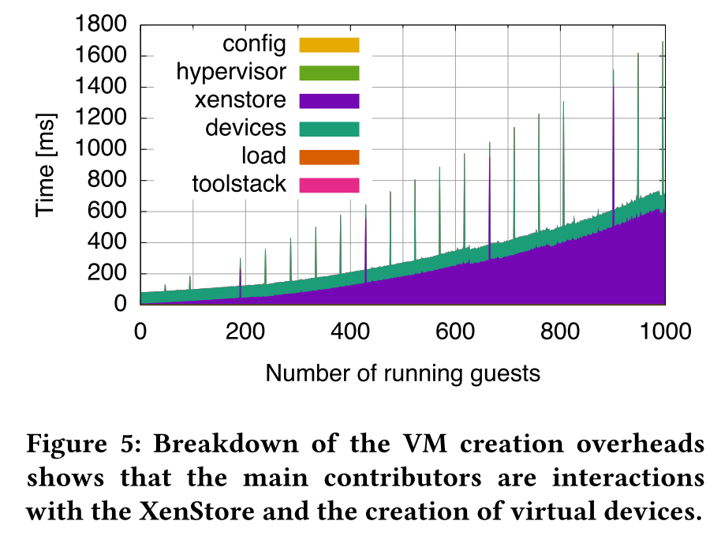
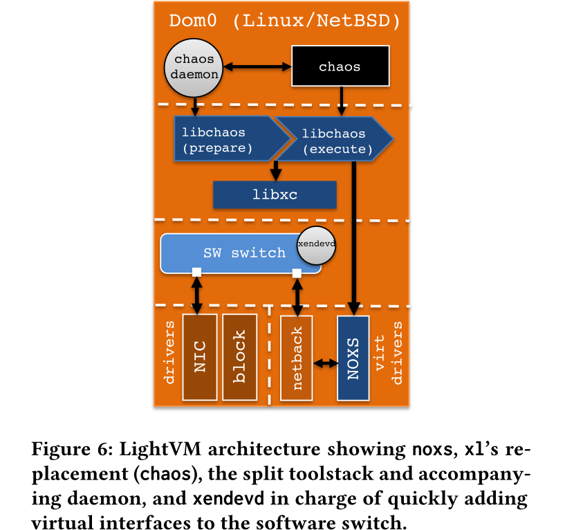
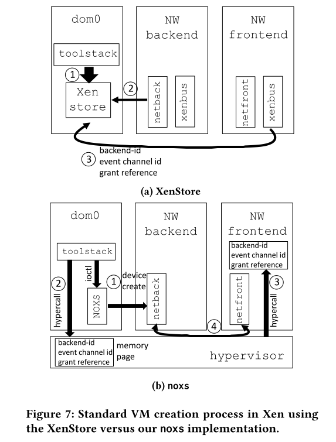

# My VM is Lighter (and Safer) than your Container

## 背景介绍

近年来，以docker为代表的容器技术飞速发展，其以灵活轻便和便于应用分发的优点得到越来越多的应用。相比于虚拟机，容器不需要完整的操作系统以及硬件虚拟化，因此对资源的利用效率非常高。可以说，程序执行速度、资源占用以及文件存储上的快速高校，是容器相比于虚拟机的一大优势。然而，容器虽然轻便小巧，但是其牺牲了安全性，容器之间无法做到安全有效的隔离。虚拟机安全但是笨重，容器高效但是不安全，这两种特性是否可以兼得呢？为了解决这个问题，作者设计了一个轻量且安全的虚拟机。

全文来讲，作者首先分析了容器和虚拟机的关键技术并进行了对比，其次使用unikernals和Tinyx这两种轻量级的虚拟机技术来进行大规模部署的对比，发现这两种技术均不能实现很好的性能，其原因在于它们在虚拟控制层面存在瓶颈。最后，作者介绍了自己的工作，基于Xen来进行优化虚拟控制层，将集中式操作转为分布式操作，从而降低单个虚拟机与管理程序的交互，从而降低启动时间，提升运行速度。作者将这个工具成为LightVM。

对于LightVM的设计，其隔离性和安全性由VM来进行保证。除此之外，作者希望其在以下几个方面可以和容器想媲美：
1. 快速启动：容器的一个优势是可以进行快速启动。容器的启动速度通常是毫秒级的，而虚拟机的启动速度通常都是数分钟。
2. 高实例密度：讲的通俗一些就是容器的资源占用低。在一台主机上，通常可以同时启动成百上千个容器，甚至有人曾尝试同时启动上万个容器。而虚拟机在这方面的表现就逊色很多，往往上百个实例就已经达到了上限。
3. 暂停、恢复功能：容器技术可以让一个运行的实例在短时间内暂停，也可以在需要的时候将其迅速重启。

## 系统设计

为什么虚拟机相对于容器的启动速度和实例密度都如此低呢？作者通过测试发现，主要是虚拟机的镜像比较大，且运行的进程比较多，因此可以从这两方面入手进行考虑。通过观察，大多数的容器和虚拟机都只运行一个程序，因此如果把虚拟机中的软件进行精简，让其正好只满足一个程序的运行环境，是否就可以达到优化效果呢？为此，作者选取了两种轻量级的虚拟化技术进行测试。

这两种虚拟化技术分别是：
- Unikernels:一种根据目标程序定制操作系统的微型虚拟机，每个虚拟机只能运行特定的程序，虚拟机的镜像大小通常只有数兆大小。
- Tinyx：一个小型的linux发行版，通常也是为指定的目标程序定制的。

作者对上面的两种技术进行了测试，测试表明，Unikernal创建的镜像性能较好，但是缺点是对应的定制开发成本比较高；而作者修改Tinyx后进行镜像开发，虚拟机的创建和容器一样的简单，镜像体积小，但是速度略慢于Unikernal。

接下来，作者开始实现自己设想的LightVM，采用的方法是对Xen进行改进。Xen的架构如图所示。

作者首先对Xen中各个部分性能进行了测试，测试结果如图所示。作者发现，在Xen中，影响VM启动的主要瓶颈在XenStore和device creation。

XenStore是Xen提供的一个域间共享的存储系统(数据库)，也可以说它是一个由Domain 0管理的简单的分层操作系统，其作为虚拟机间的中介通信是基于共享内存页与事件通道来实现的。XenStore中存储了各个虚拟机（包括Domain 0）的配置信息，例如Domain ID，Domain Name，UUID，前后端设备，启动时间，虚拟机状态等。XenStore中存储了Domain之间共享的配置信息，Domain 0作为管理域，可以查看整个结构的内容，而Domain U只能查看自身的信息，这种设计方法提高了Xenstore的安全性。从上图中可以看出，device creation的开销基本是一个常量，不随VM实例数量的增加而增长，而XenStore的时间开销则随着VM实例数量的增加而显著增长。为此，作者修改了Xen的架构，提出noxs（No XenStore）并扩展了hypervisor，以取代XenStore。前后端驱动不再通过XenStore的message机制而使用共享内存交互，由此减少了domain切换的开销。修改后的架构如图所示。

XenStore和noxs的对比如图所示。

此外，作者将VM启动过程中的toolstack分割为prepare和execute两个phase，prepare phase中包含所有VMs 通用的功能，这部分可交给守护进程（chaos daemon）在后台周期完成，提前创造出通用的VM shells存放在池中。而execute phase负责实例化过程中每个VM差异性的事务。通过对toolstack的分割，有效降低了VM启动的时间成本。
