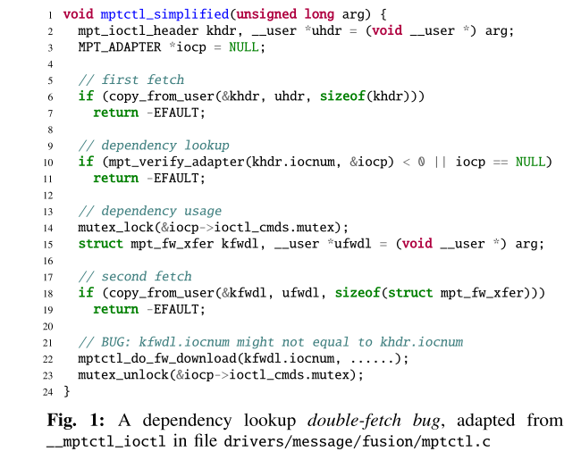
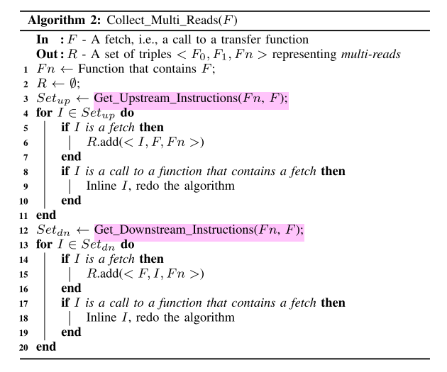
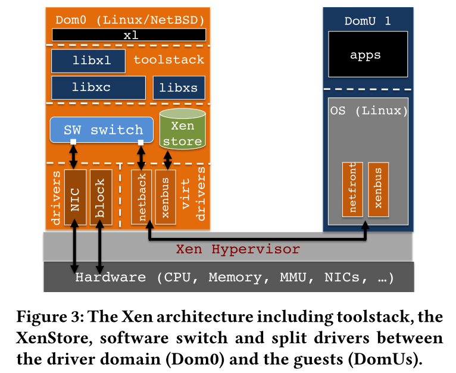

# Precise and Scalable Detection of Double-Fetch Bugs in OS Kernels

操作系统的内核在系统调用的执行期间可能多次读取同一块用户空间的内存，若两次次读取之间用户空间内存中的内存发生了变化，则可能导致double-fetch这种bug。之前的很多工作尝试通过静态或动态的方法来检测这种bug，然而由于对double-fetch定义不清晰，这些工作在检测的本质上就存在一定缺陷，从而导致大量的漏报和误报。

本文首先对double-fetch进行了正式和精确的定义，并设计了静态分析工具DEADLINE来自动化探测linux kernal中的double-fetch错误。工具发现了Linux系统中的23个新bug。

## 背景介绍

内核是操作系统的重要区域，一旦发生bug将造成很严重的危害。目前有很多工作针对内核中的bug进行探测和防御，但是大部分对于逻辑漏洞无能为力。double-fetch就是一类重要的逻辑漏洞，曾经有攻击者利用windows中的此类漏洞来进行提权。double-fetch的前提是double-reads，而内核中由于多线程多次读取一块空间而导致double-reds的情况普遍存在。例如，内核需要从用户空间读取一块最大长度为4kb的变长数据时，会预先分配一个4kb的缓冲区，并一次性从用户空间读取4kb长度的数据。然而，大多数情况下有效数据的长度只有64字节或是更少，此时出于优化的考虑，内核会先读取4字节的数据，之后再分配缓冲区大小并读取字节粒度的数据。

对于Linux系统而言，正常运行时内核中存在上千个multi-reads的情况，但不一定都是double-fetch而产生错误。那如何进行合理的判断呢？之前的方法主要是人工审计可能存在这些问题的代码，因此十分的低效。因此本文设计了一个名为DEADLINE的工具，用于通过静态分析来自动化检测double-fetch这种bug，并具有很高的检测精度和覆盖率。

### 地址空间划分

在现代操作系统中，虚拟内存分为用户空间和内核空间区域。用户空间区域对于系统中运行的每个进程都是分开的，因此每一个程序都可以看到一块自己的内存空间。程序的用户空间地址可以被该程序下的所有线程以及系统的内核进程所访问；而内核空间区域是只有内核才可以访问的。此外，虽然内核可以访问用户空间地址，但是出于安全性和隔离性的考虑，内核不会直接读取用户空间地址或者直接解引用用户地址空间的指针，而是采用系统单独设计的拷贝函数来将数据从用户空间拷贝到内核空间使用，例如Linux中的copy_from_user，get_user和FreeBSD中的copyin，fuword。这些方案不仅会进行数据传输，还主动验证用户空间访问的正确性，并处理非法地址或页面错误等异常。

### multi-reads的普遍性

出于性能的考虑，内核进程在从用户地址空间拷贝数据时，一般不会直接进行数据拷贝。更常见的操作是，先从用户空间读取需要拷贝数据的大小（size），进行校验之后，再使用该大小分配特定的缓冲区大小，并从用户空间去拷贝size大小的数据，因此会发生至少两次fetch操作。通常，这两种fetch操作会有一定的关联，而size只是其中的一种情况。作者总结，两次fetch操作的数据通常有以下关系：
- 依赖查找：对于一次数据读取请求，可能有多个对应的处理函数。内核先从用户空间拷贝一些特征信息，判断即将读取的数据类型，并查找应该使用哪个对应的处理函数，判断之后进行第二次读取。示例如图所示。

- 协议/签名校验：第一次读操作先读取特定的协议版本号或消息签名，内核校验通过后再进行下一次读取。

- 信息猜测：如果缺乏数据的具体位置信息，内核可能通过使用循环来多次读取，尝试找到有效的数据位置，然后再使用一次读取从用户空间拷贝完整数据。

## 形式化定义double-fetch

为了便于后续使用程序来查找double-fetch错误，论文首先对这种错误进行了形式化的定义。作者认为，double-fetch的确认过程必须经过以下的四个步骤：
1. 至少有两次对用户空间的读操作，即double-fetch的前提是multi-reads。这一点可以通过扫描代码中的copy_from_user()函数来确定；
2. 两次读取的内容必须要有重叠部分，才可能发生错误。进一步来说，这个nulti-reads必须是一个overlapped-fetch；
3. 两次读取的数据必须要有一定的关联，可以是数据以来或者控制依赖；
4. 两次读取的重叠部分不能被证明在两次不同的读取中一定是相同的，也就是说用户空间可能因为条件竞争而在两次读取之间改变了这个区域的值。

论文中对上述的几个定义都进行了符号化的表述。

## 系统设计

### 概述

DEADLINE使用符号执行来对内核代码进行静态符号检查以确定double-fetch错误。符号执行在LLVM IR的层次上进行，前人的工作也表明了在IR层面进行符号执行相比于源码来说有诸多的好处。整个工具的运行流程如下图的伪代码算法，即首先扫描内核所有的代码，收集所有的multi-reads情况，并对每一组有关联的multi-reads执行符号执行检查，判断是否会导致double-fetch错误，如果是，则将其加入输出集合。

### 发现multi-reads

分为两个步骤，对应着两个处理过程

1. Collect_Multi_Reads(F)

    > 扫描内核中所有的fetch操作，将相关联的两次读取保存进一个<F0,F1,Fn >的元祖，将这个元祖存入结果集合。
    

2. Construct_Execution_Paths(F0, F1, Fn)

    > 这个函数有两个作用，第一是确定两个fetch操作F0和F1之间的所有路径，通过遍历CFG即可得到；第二是找到两次fetch中的可能导致double-fetch的关键数据，即第一次fetch并可能影响到路径信息的数据。

### 从multi-reads到double-fetch

与常规的符号执行不同在于，传统的符号执行在处理内存读写时，若两次读取同一位置的操作之间没有内存的写操作，则假设从同一位置读取的值都是一样的。但这个模型在当前的环境中显然是不适用的，否则就找不到double-fetch错误了。为了解决这个问题，DEADLINE采取的方法是对每一次的内存读取进行编号，以表示两次读取的内容可以不同。

最后，使用Z3来求解约束，看是否满足形式化定义中提出的四个条件，从而求解是否存在double-fetch。

最后，作者给出了一个完整的案例分析，如图所示。

# Virtual machine monitors: Current technology and future trends

## 背景介绍

虚拟机技术的发展经历了很多次的波折。在1960年左右，计算机都是大型机，硬件的资源十分昂贵。为了对这种硬件资源进行高效的复用，诞生了基于软件层面的虚拟机管理技术（VMM）。后来，到了上世纪八十年代，随着多任务操作系统的诞生以及硬件成本的下降，VMM技术逐渐退出了历史舞台。

然而，VMM这项技术并没有消失。二十世纪末，斯坦福的研究学者开始关注用VMM来解决硬件和操作系统的兼容问题，尝试利用VMM技术对复杂的硬件体系结构进行改进，以支持现有的操作系统。这个想法诞生了迄今为止仍然是虚拟机领域霸主的VMware公司。新世纪初，随着计算机硬件成本的进一步下降，机器的数量迅速增加，管理人员的管理任务也变得复杂起来。此外，单台计算机的运算能力也不断提升，功能和服务不断增多，增大了单台计算机崩溃的可能性，管理成本进一步提高。为了减少系统崩溃，系统管理员开始“主动降低硬件水平”，尝试每台机器运行一个应用程序。这反过来又增加了硬件需求，造成了巨大的成本和管理开销。这时，VMM技术再次出现在人们的视野，将曾经在许多物理机器上运行的应用程序移动到虚拟机中，并将这些虚拟机整合到几个物理平台上，可以提高使用效率并降低空间和管理成本。由此，VMM技术的发展再次迅猛起来，并得到了很多大公司的资本和技术支持。

## 虚拟机技术

VMM技术再次进入人们的视野之后，就不再是之前单纯的出于硬件复用的考虑，更多是出于运行效率、安全性和方便管理的考虑。VMM技术的主要架构设计如图所示，核心的需求是在硬件和操作系统之间提供一个中间层，用于给操作系统提供一个硬件操作的接口。

从技术角度讲，VMM必须能够将硬件接口导出到虚拟机中的软件，该硬件大致等同于物理硬件。此外，VMM还需保持对物理硬件的控制，并保留在虚拟机和物理硬件的能力。出于这个技术目的，有很多不同的技术实现方案。在评估这些权衡时，VMM的中心设计目标是兼容性，性能和简单性。兼容性显然非常重要，因为VMM的主要优势在于其运行传统软件的能力。性能这个衡量虚拟化开销的目标是以与软件在物理机上的运行开销对比的。当然，简单性尤其重要，因为VMM故障可能会导致计算机上运行的所有虚拟机发生故障。当然，虚拟机还有重要的一点就是安全性，隔离性保证攻击者不能轻易进行虚拟机逃逸以攻击Host OS。

## CPU虚拟化

CPU硬件虚拟化技术允许虚拟机中的指令能在CPU上直接运行，可以将其概述为“直接执行”机制。这要求CPU能在非特权模式下运行虚拟机的特权和非特权代码，而VMM以特权模式运行。因此，当虚拟机尝试执行特权操作时，CPU会陷入VMM，VMM模拟VMM管理的虚拟机状态上的特权操作。因此，设计的关键是如何让VMM安全、透明地执行虚拟机中的代码。

### 挑战

这篇文章发表于2005年，文章认为主要的挑战是大多数的CPU并不支持虚拟化特性，包括流行的X86架构。x86不支持虚拟化特性，并且中断和特权指令的处理机制都不满足VMM的设计需求。

### 技术

有几种技术解决了如何在不能虚拟化的CPU上实现VMM，最常见的是半虚拟化，将“直接执行”机制与快速二进制翻译相结合。通过半虚拟化，VMM通过用简单虚拟化，替换原始指令集的非虚拟化部分，来定义虚拟机接口。尽管必须将操作系统移植到虚拟机中运行，但大多数正常应用程序仍可以不加修改地运行。最后VMware参与推动这项技术，核心就是对将特权指令进行二进制转换。在大多数现代操作系统中，运行正常应用程序的处理器模式都是可虚拟化的，因此可以使用直接执行来运行；而二进制转换器用来运行不可虚拟化的特权模式。最终是设计一个与硬件相匹配的高性能虚拟机，从而保持了软件的全面兼容性。

### 未来发展

当然，预期的发展目标就是在CPU直接实现硬件级别的虚拟化。AMD和Intel都宣布了即将在自家的产品上实现虚拟化特性，当然牙膏厂也并没有实验，2005年就推出了相关技术。

## 内存虚拟化

内存虚拟化的传统实现是VMM在物理机器上维护一个影子内存，用于映射虚拟机中的内存数据，以便对虚拟机内存进行精确管理。当虚拟机中运行的操作系统在其页面表中建立映射时，VMM检测到这些更改并在相应的影子页表项中建立一个映射，指向硬件存储器中的实际页面位置。当虚拟机进行内存读写时，硬件使用影子页表进行内存转换，这样VMM就可以控制每个虚拟机正在使用的内存。与传统操作系统的虚拟存储系统设计一样，VMM可以将虚拟机分页到磁盘，以便分配给虚拟机的内存可以超过硬件的物理内存大小，这样的设计可以让VMM高效使用硬件资源。VMM可以根据需要动态控制每个虚拟机获得的内存量。

### 挑战

VMM的虚拟内存子系统会不断控制进入虚拟机中的活跃内存页，并且必须通过将虚拟机的一部分分配给磁盘来定期回收部分内存。然而，对于这样一套内存管理机制，在虚拟机（GuestOS）中运行的操作系统可能比VMM的虚拟内存系统具有更多的信息，这些信息可以被用于更好地管理分页。例如，一个GuestOS可能会注意到创建页面的过程已经退出，这意味着该页面可能不会再被访问，而在硬件级别上运行的VMM不会看到这一点，并可能会将该页面分页。为了解决这个问题，VMware的ESX Server采用了类似半虚拟化的方法，其中在GuestOS内运行的气球进程可以与VMM进行通信。当VMM想要从虚拟机中读取内存时，它要求“气球程序”处理分配更多的内存，实质上是“膨胀”了这个过程。然后，GuestOS使用其关于页面替换的深入信息来选择要提供给扩展进程的页面，并将这个信息传递给VMM用于内存页面管理。

### 未来发展

未来的发展自然是将虚拟内存管理的这套影子内存系统放在硬件上进行实现

## I/O虚拟化

30年前，IBM大型机的I/O子系统使用基于通道的架构，其中通过与单独的通道处理器进行通信来访问I/O设备。通过使用通道处理器，VMM可以安全地将I/O设备访问直接导出到虚拟机,虚拟化开销非常低。

### 挑战
VMware Workstation开发了图所示的托管体系结构。在此体系结构中，虚拟化层使用主机操作系统（HostOS）的设备驱动程序来访问设备。

另一个问题是，现代操作系统（如Windows和Linux）没有资源管理支持来为虚拟机提供性能隔离和服务保证，而这是许多服务器环境所需的功能。 ESX Server采用更传统的VMM方法，无需主机操作系统即可直接在硬件上运行。除了复杂的调度和资源管理外，ESX Server还为网络和存储设备提供高度优化的I/O子系统。

### 未来发展

使用硬件来进行高性能的I/O虚拟化。

## 总结

最后，作者研究了虚拟机的特性和使用场景。虚拟机的一大特性就是安全性和隔离性，由于对外提供服务的是虚拟机，安全性保证了黑客获取虚拟机权限后不会进一步逃逸从而影响到物理机器，因此这个特性是虚拟机未来的一大应用方向和改进点。其次，作者注意到，越来越多的厂商开始利用虚拟机进行软件分发，诸如oracle这种庞大的软件，厂商只需要提供给用于一个配置好的虚拟机镜像，用户实现了“开箱即用”而不用再去繁琐的配置环境。这一点很有感触，这也是今天容器技术快速发展的一个重要推动力。

# My VM is Lighter (and Safer) than your Container

## 背景介绍

近年来，以docker为代表的容器技术飞速发展，其以灵活轻便和便于应用分发的优点得到越来越多的应用。相比于虚拟机，容器不需要完整的操作系统以及硬件虚拟化，因此对资源的利用效率非常高。可以说，程序执行速度、资源占用以及文件存储上的快速高校，是容器相比于虚拟机的一大优势。然而，容器虽然轻便小巧，但是其牺牲了安全性，容器之间无法做到安全有效的隔离。虚拟机安全但是笨重，容器高效但是不安全，这两种特性是否可以兼得呢？为了解决这个问题，作者设计了一个轻量且安全的虚拟机。

全文来讲，作者首先分析了容器和虚拟机的关键技术并进行了对比，其次使用unikernals和Tinyx这两种轻量级的虚拟机技术来进行大规模部署的对比，发现这两种技术均不能实现很好的性能，其原因在于它们在虚拟控制层面存在瓶颈。最后，作者介绍了自己的工作，基于Xen来进行优化虚拟控制层，将集中式操作转为分布式操作，从而降低单个虚拟机与管理程序的交互，从而降低启动时间，提升运行速度。作者将这个工具成为LightVM。

对于LightVM的设计，其隔离性和安全性由VM来进行保证。除此之外，作者希望其在以下几个方面可以和容器想媲美：
1. 快速启动：容器的一个优势是可以进行快速启动。容器的启动速度通常是毫秒级的，而虚拟机的启动速度通常都是数分钟。
2. 高实例密度：讲的通俗一些就是容器的资源占用低。在一台主机上，通常可以同时启动成百上千个容器，甚至有人曾尝试同时启动上万个容器。而虚拟机在这方面的表现就逊色很多，往往上百个实例就已经达到了上限。
3. 暂停、恢复功能：容器技术可以让一个运行的实例在短时间内暂停，也可以在需要的时候将其迅速重启。

## 系统设计

为什么虚拟机相对于容器的启动速度和实例密度都如此低呢？作者通过测试发现，主要是虚拟机的镜像比较大，且运行的进程比较多，因此可以从这两方面入手进行考虑。通过观察，大多数的容器和虚拟机都只运行一个程序，因此如果把虚拟机中的软件进行精简，让其正好只满足一个程序的运行环境，是否就可以达到优化效果呢？为此，作者选取了两种轻量级的虚拟化技术进行测试。

这两种虚拟化技术分别是：
- Unikernels:一种根据目标程序定制操作系统的微型虚拟机，每个虚拟机只能运行特定的程序，虚拟机的镜像大小通常只有数兆大小。
- Tinyx：一个小型的linux发行版，通常也是为指定的目标程序定制的。

作者对上面的两种技术进行了测试，测试表明，Unikernal创建的镜像性能较好，但是缺点是对应的定制开发成本比较高；而作者修改Tinyx后进行镜像开发，虚拟机的创建和容器一样的简单，镜像体积小，但是速度略慢于Unikernal。

接下来，作者开始实现自己设想的LightVM，采用的方法是对Xen进行改进。Xen的架构如图所示。

作者首先对Xen中各个部分性能进行了测试，测试结果如图所示。作者发现，在Xen中，影响VM启动的主要瓶颈在XenStore和device creation。

XenStore是Xen提供的一个域间共享的存储系统(数据库)，也可以说它是一个由Domain 0管理的简单的分层操作系统，其作为虚拟机间的中介通信是基于共享内存页与事件通道来实现的。XenStore中存储了各个虚拟机（包括Domain 0）的配置信息，例如Domain ID，Domain Name，UUID，前后端设备，启动时间，虚拟机状态等。XenStore中存储了Domain之间共享的配置信息，Domain 0作为管理域，可以查看整个结构的内容，而Domain U只能查看自身的信息，这种设计方法提高了Xenstore的安全性。从上图中可以看出，device creation的开销基本是一个常量，不随VM实例数量的增加而增长，而XenStore的时间开销则随着VM实例数量的增加而显著增长。为此，作者修改了Xen的架构，提出noxs（No XenStore）并扩展了hypervisor，以取代XenStore。前后端驱动不再通过XenStore的message机制而使用共享内存交互，由此减少了domain切换的开销。修改后的架构如图所示。

XenStore和noxs的对比如图所示。

此外，作者将VM启动过程中的toolstack分割为prepare和execute两个phase，prepare phase中包含所有VMs 通用的功能，这部分可交给守护进程（chaos daemon）在后台周期完成，提前创造出通用的VM shells存放在池中。而execute phase负责实例化过程中每个VM差异性的事务。通过对toolstack的分割，有效降低了VM启动的时间成本。

# Making Smart Contracts Smarter 

区块链是一种分布式账本技术。通常来讲，区块链可以被理解为一种按照时间顺序，将数据区块前后链接形成的特定数据结构，同时采用密码学的方法保证其不可篡改性。它可以被认为是一个分布式的数据库，全网分布式节点不仅参与数据存储，还同时参与数据记录与维护，并通过共识算法达成一致。区块链最早在2008年由Satoshi Nakamoto所发表的论文《Bitcoin: A peer-to-peer electronic cash system》提出。作为比特币、以太坊等数字货币的底层核心技术，区块链可以有效解决P2P网络中的共识问题，具有去中心化、去信任、数据不可篡改等特点。区块链突破了传统社会依赖于可信第三方的信任模式，通过共识机制解决去中心化系统中分布式节点间的信任问题，实现了信息的可信传播，是对信任模式和信息传播机制的重大突破。区块链在其诞生之初并没有受到广泛的关注，但随着比特币网络长期的稳定运行，其底层技术渐渐引起了各界广泛关注。早期，受比特币影响，人们将大部分研究经历放在区块链技术在加密货币领域的应用。但随着研究深入，人们发现区块链可以在任何需要建立分布式信任关系的领域颠覆传统技术，发挥巨大作用。近五年来区块链技术相关论文数量急速增加，覆盖医疗、保险、信息科学、电子商务等众多学科。

比特币开启了区块链1.0时代。而智能合约的诞生被视为区块链2.0时代的开端，极大地扩展了区块链的应用场景与现实意义。目前，世界最大的可运行智能合约的区块链系统为以太坊。以太坊系统发展迅猛，开发者社区不断扩大，其安全性也逐渐受到人们的重视。本文基于符号执行技术，开发了一个称为oyente的工具，可以对以太坊上运行的智能合约进行安全检测。

## 背景介绍

智能合约可以处理大量数字货币，目前以太坊中有超过200个利用智能合约实现的代币系统市值过亿。与传统的分布式平台不同，智能合约在开放的网络中运行，在巨大的利益诱惑下，很容易受到攻击。尽管合约一旦部署，就需要严格遵循代码逻辑运行，但攻击者仍可以利用特殊参数、调用顺序或是时间戳等区块链状态，对运行结果造成影响。为了避免合约受到攻击，开发人员需要对合约代码的微妙语义有充分的把握，熟悉可能存在的各种漏洞，并加以预防。然而目前智能合约的安全性尚未受到开发者重视。经典的The Dao事件中，黑客攻击智能合约盗取了高达六千万美元的以太币，并造成了以太坊链的分叉，后果十分严重。而据现有检测结果来看，以太坊中可能有超过90%的合约存在明显漏洞。由于智能合约不能像普通计算机系统一样进行升级和修改，故需要在合约发布前进行充分的测试与审核。对潜在安全威胁进行充分分析，有助于开发者在编码阶段对规避漏洞产生，也有助于后续研究的进一步展开。此外，随着合约功能日益复杂，人力往往难以对代码安全性进行充分考量，故需要开发自动化工具来协助完成这一检测过程。

## 技术介绍

### 以太坊

以太坊延续了经典的区块链结构，主要由数据层、网络层、共识层、应用层四个部分构成。
- 数据层：数据层主要由底层数据区块与其链式结构构成，区块间以哈希摘要相连，并以Merkle树形式存储与索引，保障了区块数据的可溯源性和完整性；
- 网络层：网络层以扁平式拓扑结构的P2P网络为基础模型，实现了交易验证和数据传播机制，以保障以太坊分布式节点间的可信数据传递。
- 共识层与激励层：该层是区块链系统的核心组件，保障了分布式账本的一致性和真实性。
- 应用层：应用层通过EVM虚拟机，对智能合约的运行进行支持，以实现以太坊上各种复杂的业务逻辑。

### 智能合约

以太坊智能合约由基于栈的字节码构成，这种低级别的字节码语言被称为EVM代码（或以太坊虚拟机代码）。代码由字节序列构成，每个字节对应一种操作。每次执行操作后，程序计数器数值加一，直到出错或遇到STOP、RETURN指令时停止。以太坊指令可以访问三种数据存储：
- 运行时栈：先进后出的数据存储，与传统计算系统中的栈概念相似。
- 内存：可无限扩展的临时存储空间，每次执行后被清空。
- 长期存储：一种键-值形式的存储空间，每次运行结束后，长期存储的内容不被清零。

## 攻击介绍

本文的一大贡献就是对已经爆发的几类针对智能合约漏洞的攻击进行了梳理。主要有以下几种攻击：
- 交易顺序依赖：不同的交易顺序可能导致不同结果。比如在悬赏中，悬赏者更改悬赏金额前后，参与者获得的报酬是不同的。攻击者可以监听网络中的事件，当发现正确结果时，迅速提交降低悬赏金额的交易，并支付更高的手续费，这样降低酬劳的操作很可能被优先处理，并使攻击者受益。此外，矿工有权限调整一个区块内交易发生的顺序，同样可以实现相似的攻击。
- 时间戳依赖：每个区块都含有一个时间戳，记录其诞生时间。智能合约常使用时间戳作为随机数产生的种子，或付款等事件触发的条件。由于广播造成的时延，以太坊网络对时间戳的误差有一定容忍度，矿工可以在一定范围内改变时间戳以获益。为了避免这种攻击，合约可以采用区块编号等无法被修改的参数代替时间戳。
- 异常处理缺失：以太坊中，智能合约可以通过send指令调用其他合约。如果被调用函数中发生了异常，会返回false值并终止执行。然而使用send指令时，调用者需要主动检查是否发生了异常。
- 重入攻击：指合约中的原子性事件由于并发的存在而遭到破坏。The Dao事件就是一个经典的重入攻击案例。

## 系统设计

作者设计了一个叫oyente的工具来对上述智能合约中的上述漏洞进行检测。工具依赖于符号执行技术。符号执行将程序变量的值表示为输入符号值的符号表达式。每个符号路径都有一个路径条件，是通过累加约束条件构建的符号输入的公式，要想到达当前的路径，则当前路径对应的路径条件必须得到满足。作者解释说，选择符号执行是因为它可以静态地推导出程序​​的所有路径。对于智能合约来说，由于代码一般比较短小，因此在符号执行中很难出现路劲爆炸的情况，是一个比较理性地运用符号执行的场景。此外，由于智能合约运行在以太坊上，要想对其进行动态测试是很困难的，这也是作者选择静态符号执行的原因。

Oyente遵循模块化设计，主要由CFGBuilder、Explorer、CoreAnalysis 和 Validator四个模块组成。

- CFGBuilder：为目标合约代码构建一个较为基础CFG图。该图包含了一些基本块作为顶点，一些可以确定的跳转路径作为边。静态分析阶段还有一些边无法确定，所以这个CFG图会在符号执行阶段进行补充。
- Explorer：该模块从上述CFG的入口节点开始，逐个遍历并可能会执行一些符号状态。Explorer的核心是一个解释器循环，循环获得一个运行状态，然后在该状态的上下文中象征性地执行单个指令。当检测到没有剩余状态或达到用户定义的超时，循环才会终止。
- CoreAnalysis：该模块是漏洞分析的核心，作者针对每一种需要检测漏洞都在该模块下实现了一个检测子模块，用于检测对应的漏洞。
- Validator：该模块的设计目的是消除误报。CoreAnalysis所检测到的合约漏洞都会标记为假阳性，并送入到该模块进行误报分析。

# Hyperkernel: Push-Buton Verification of an OS Kernel

## 背景介绍

内核是计算机系统中最关键的组件之一，它为用户应用程序提供了基本的运行环境和服务支持。例如，内核强制进程之间的隔离机制可以让多个应用程序安全地共享CPU、内存等资源。因此，内核中的错误会严重影响正确性和安全性，从而导致单个应用程序中的错误行为，从而导致恶意应用程序破坏整个系统。因此，如何设计一个可以被证明“正确”的系统显得尤为重要。

证明一个系统设计正确性的方法主要是靠形式化证明，这方面有很多前述的研究，UCLA Secure Unix、PSOS、KIT、VFasico、seL4d等都是经过形式化验证的系统内核。然而之前研究的一个最大问题是，内核有大量的复杂函数和接口，将形式化证明运用于内核不仅需要耗费大量的人力，而且对于人员的素养要求很高。本文所解决的问题就是，如何开发一个工具，可以高度自动化地验证系统内核的正确性，并提高验证的效率。

设计这样一个自动化工具面临着三大挑战：

1. 工具的设计需要在设计难度可用性以及自动化证明之间进行折中；
2. 在虚拟内存管理上，如何分离内存中的用户空间与内核空间，以便简化证明中的内存管理。内核中由于虚拟内存机制的存在，导致物理内存和虚拟内存并不是单射的关系，一处地址对应多出引用，难以管理，需要尽量的消除；
3. C语言编写的代码存在指针运算，内存访问等，这些都是一些底层的行为，将会使得推理变得非常复杂。如何对C语言代码进行建模就是一个棘手的问题。

作者通过在xv6系统上进行修改，重新设计了xv6的内核接口，编写交互式定理证明以让其适用于约束求解，由此产生Hyperkernal。之后通过Z3约束求解器对Hyperkernal进行了验证，发现hyperkernal可以避免原来xv6中的一些已知错误。

## 系统设计

系统的基础架构如图所示，主要包含两种形式的规范，以描述内核接口设计的正确性：

1. 确保功能正确性的详细规范；
2. 确保更便于人工审查的高层次规范。

为了保证与Z3的正常交互以及编写的便捷，上述的两个规范均采用python来实现。系统调用部分使用C来实现，并会被编译为LLVM IR的形式来进行验证。本文的设计依赖于两个假设：

- 内核运行在禁用终端的单核处理器上，因此每个系统调用都是原子的；
- 内核使用虚拟内存管理，但是和用户地址空间彼此独立。

### 有限的接口

如何设计一个有限的接口？作者这里给出了一个例子如图所示。在传统的unix系统中，文件描述符的分配规则是，每次选择一个可用的最小编号用于分配。但是这样带来的一个问题是，这个编号的获取需要通过搜索，且没有一个最小常数限制，而且可能随着FD的大小和文件状态而变化，这意味着验证的过程会因为FD表的长度而不同，因此并不是一个有限的接口。接口的修改改为dup(oldfd,newfd)，这个newfd由用户调用时自行指定。

设计一个有限接口的三个准则：

1. 强制资源被引用的生命周期；
2. 强制进行细粒度的保护；
3. 验证链接资源的结构。

### 规范

在有限接口的前提下，通过设计状态机规范来描述期望的内核行为，这个规范可以分为以下两种：

- 抽象的内核状态：内核中较为抽象的状态，用固定宽度的整数和map来定义；
- 声明的规范：高级层次的声明规范，以fd为例，记录每一个文件被引用的数量所需要满足的规范就属于这个规范的范畴层次。

状态转换规范：验证系统调用参数，并在验证通过时将系统切换到下一个状态。

### 验证

给出了两个定理：

- 内核实现是状态机规范的精炼，作者将状态机规范和实现都转换为可以用SMT验证的模式，并检查在每一步转换时，是否按照状态机进行
- 状态机规范满足声明规范，即每一次状态转换后是否满足声明

根据这样的定理，可以找到实现中的bug和状态机设计中违反声明的bug

# The Scalable Commutativity Rule: Designing Scalable Software for Multicore Processors

## 背景介绍

在传统的软件设计领域，评价一个软件的可扩展性，通常是从软件设计的架构来考虑。但是本篇文章中作者认为操作具有交换性的接口，是可以实现为可扩展的。由此作者们提出了新的观点：可扩展性不应当被理解成一种软件实现的特性，而应当理解成一种软件接口设计的特性。也就是说，软件的可扩展性应当从接口的设计时就开始考量，而不应当等到实现时再去优化。本文围绕如何设计一个可扩展的API来论述，并设计了一个名为commuter的工具，可以对接口的模型进行形式化的分析。在作者看来，新的实现软件可扩展性设计的方法是，先设计接口的模型，通过工具分析证明其commutativity，然后再根据模型去实现具体的接口代码。

## 可扩展性规则

SIM交换性规则：如果在一个线程中交换了两个操作，并不影响它们得出的结果，则称这两个操作为可交换的。论文中证明了如果两个操作可以交换，则这个操作一定存在一种没有冲突的，可扩展性的实现。

可扩展性规则：如果操作是可以交换的，那么这就意味着我们使用接口来区分操作的执行顺序，也就意味着存在一种可扩展的方式来实现这些操作。一般的，如果一组操作在内存访问上是没有冲突的，我们就认为这组操作时可扩展的。

