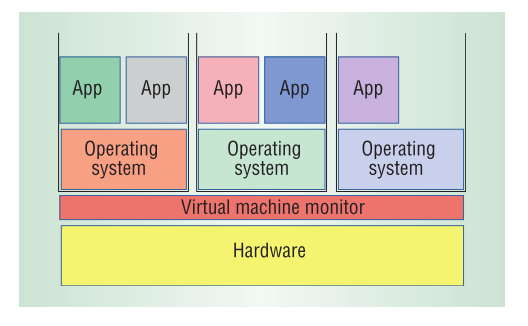
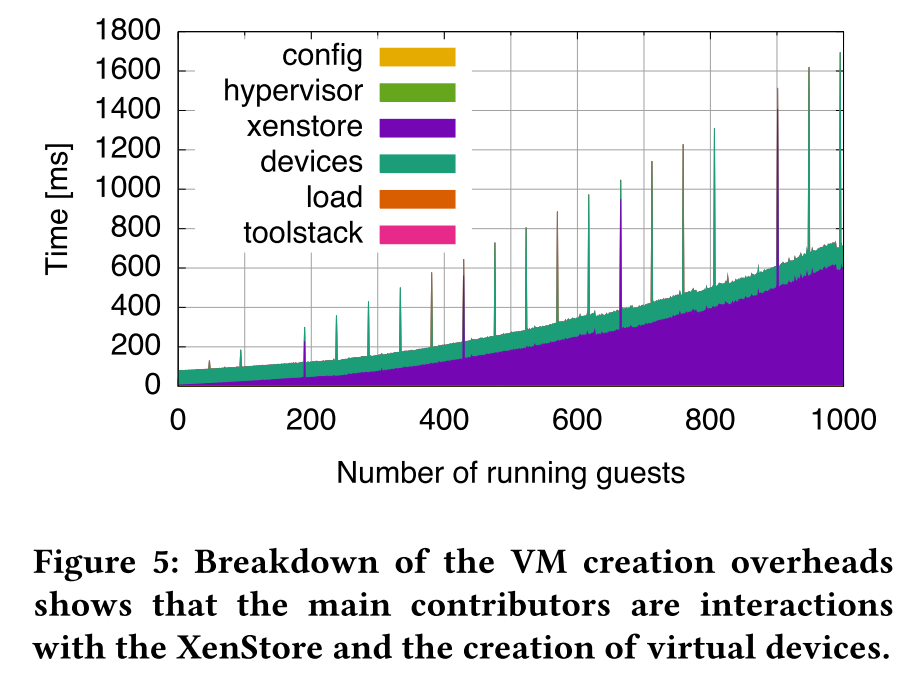
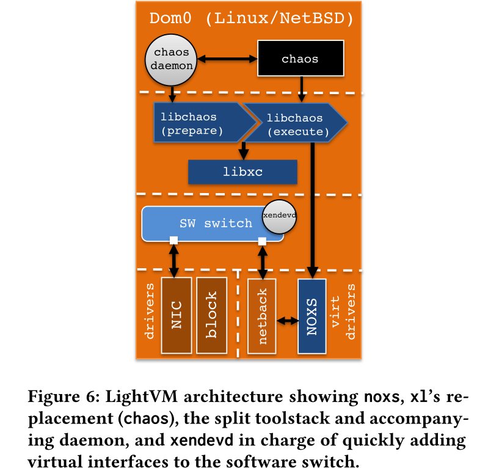
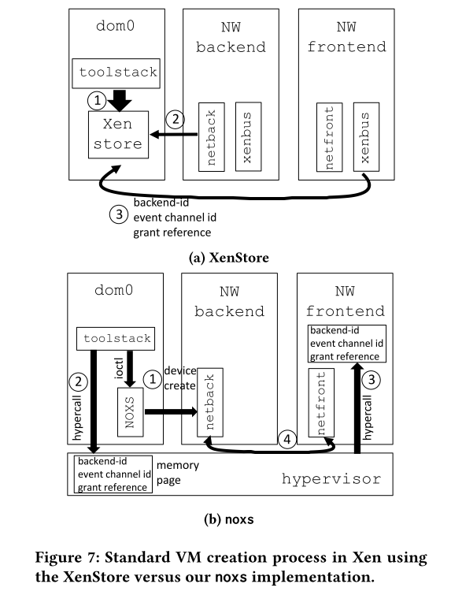

# Precise and Scalable Detection of Double-Fetch Bugs in OS Kernels

操作系统的内核在系统调用的执行期间可能多次读取同一块用户空间的内存，若两次次读取之间用户空间内存中的内存发生了变化，则可能导致double-fetch这种bug。之前的很多工作尝试通过静态或动态的方法来检测这种bug，然而由于对double-fetch定义不清晰，这些工作在检测的本质上就存在一定缺陷，从而导致大量的漏报和误报。

本文首先对double-fetch进行了正式和精确的定义，并设计了静态分析工具DEADLINE来自动化探测linux kernal中的double-fetch错误。工具发现了Linux系统中的23个新bug。

## 背景介绍

内核是操作系统的重要区域，一旦发生bug将造成很严重的危害。目前有很多工作针对内核中的bug进行探测和防御，但是大部分对于逻辑漏洞无能为力。double-fetch就是一类重要的逻辑漏洞，曾经有攻击者利用windows中的此类漏洞来进行提权。double-fetch的前提是double-reads，而内核中由于多线程多次读取一块空间而导致double-reds的情况普遍存在。例如，内核需要从用户空间读取一块最大长度为4kb的变长数据时，会预先分配一个4kb的缓冲区，并一次性从用户空间读取4kb长度的数据。然而，大多数情况下有效数据的长度只有64字节或是更少，此时出于优化的考虑，内核会先读取4字节的数据，之后再分配缓冲区大小并读取字节粒度的数据。

对于Linux系统而言，正常运行时内核中存在上千个multi-reads的情况，但不一定都是double-fetch而产生错误。那如何进行合理的判断呢？之前的方法主要是人工审计可能存在这些问题的代码，因此十分的低效。因此本文设计了一个名为DEADLINE的工具，用于通过静态分析来自动化检测double-fetch这种bug，并具有很高的检测精度和覆盖率。

# Virtual machine monitors: Current technology and future trends

## 背景介绍

虚拟机技术的发展经历了很多次的波折。在1960年左右，计算机都是大型机，硬件的资源十分昂贵。为了对这种硬件资源进行高效的复用，诞生了基于软件层面的虚拟机管理技术（VMM）。后来，到了上世纪八十年代，随着多任务操作系统的诞生以及硬件成本的下降，VMM技术逐渐退出了历史舞台。

然而，VMM这项技术并没有消失。二十世纪末，斯坦福的研究学者开始关注用VMM来解决硬件和操作系统的兼容问题，尝试利用VMM技术对复杂的硬件体系结构进行改进，以支持现有的操作系统。这个想法诞生了迄今为止仍然是虚拟机领域霸主的VMware公司。新世纪初，随着计算机硬件成本的进一步下降，机器的数量迅速增加，管理人员的管理任务也变得复杂起来。此外，单台计算机的运算能力也不断提升，功能和服务不断增多，增大了单台计算机崩溃的可能性，管理成本进一步提高。为了减少系统崩溃，系统管理员开始“主动降低硬件水平”，尝试每台机器运行一个应用程序。这反过来又增加了硬件需求，造成了巨大的成本和管理开销。这时，VMM技术再次出现在人们的视野，将曾经在许多物理机器上运行的应用程序移动到虚拟机中，并将这些虚拟机整合到几个物理平台上，可以提高使用效率并降低空间和管理成本。由此，VMM技术的发展再次迅猛起来，并得到了很多大公司的资本和技术支持。

## 虚拟机技术

VMM技术再次进入人们的视野之后，就不再是之前单纯的出于硬件复用的考虑，更多是出于运行效率、安全性和方便管理的考虑。VMM技术的主要架构设计如图所示，核心的需求是在硬件和操作系统之间提供一个中间层，用于给操作系统提供一个硬件操作的接口。

从技术角度讲，VMM必须能够将硬件接口导出到虚拟机中的软件，该硬件大致等同于物理硬件。此外，VMM还需保持对物理硬件的控制，并保留在虚拟机和物理硬件的能力。出于这个技术目的，有很多不同的技术实现方案。在评估这些权衡时，VMM的中心设计目标是兼容性，性能和简单性。兼容性显然非常重要，因为VMM的主要优势在于其运行传统软件的能力。性能这个衡量虚拟化开销的目标是以与软件在物理机上的运行开销对比的。当然，简单性尤其重要，因为VMM故障可能会导致计算机上运行的所有虚拟机发生故障。当然，虚拟机还有重要的一点就是安全性，隔离性保证攻击者不能轻易进行虚拟机逃逸以攻击Host OS。

## CPU虚拟化

CPU硬件虚拟化技术允许虚拟机中的指令能在CPU上直接运行，可以将其概述为“直接执行”机制。这要求CPU能在非特权模式下运行虚拟机的特权和非特权代码，而VMM以特权模式运行。因此，当虚拟机尝试执行特权操作时，CPU会陷入VMM，VMM模拟VMM管理的虚拟机状态上的特权操作。因此，设计的关键是如何让VMM安全、透明地执行虚拟机中的代码。

### 挑战

这篇文章发表于2005年，文章认为主要的挑战是大多数的CPU并不支持虚拟化特性，包括流行的X86架构。x86不支持虚拟化特性，并且中断和特权指令的处理机制都不满足VMM的设计需求。

### 技术

有几种技术解决了如何在不能虚拟化的CPU上实现VMM，最常见的是半虚拟化，将“直接执行”机制与快速二进制翻译相结合。通过半虚拟化，VMM通过用简单虚拟化，替换原始指令集的非虚拟化部分，来定义虚拟机接口。尽管必须将操作系统移植到虚拟机中运行，但大多数正常应用程序仍可以不加修改地运行。最后VMware参与推动这项技术，核心就是对将特权指令进行二进制转换。在大多数现代操作系统中，运行正常应用程序的处理器模式都是可虚拟化的，因此可以使用直接执行来运行；而二进制转换器用来运行不可虚拟化的特权模式。最终是设计一个与硬件相匹配的高性能虚拟机，从而保持了软件的全面兼容性。

### 未来发展

当然，预期的发展目标就是在CPU直接实现硬件级别的虚拟化。AMD和Intel都宣布了即将在自家的产品上实现虚拟化特性，当然牙膏厂也并没有实验，2005年就推出了相关技术。

## 内存虚拟化

# My VM is Lighter (and Safer) than your Container

## 背景介绍

近年来，以docker为代表的容器技术飞速发展，其以灵活轻便和便于应用分发的优点得到越来越多的应用。相比于虚拟机，容器不需要完整的操作系统以及硬件虚拟化，因此对资源的利用效率非常高。可以说，程序执行速度、资源占用以及文件存储上的快速高校，是容器相比于虚拟机的一大优势。然而，容器虽然轻便小巧，但是其牺牲了安全性，容器之间无法做到安全有效的隔离。虚拟机安全但是笨重，容器高效但是不安全，这两种特性是否可以兼得呢？为了解决这个问题，作者设计了一个轻量且安全的虚拟机。

全文来讲，作者首先分析了容器和虚拟机的关键技术并进行了对比，其次使用unikernals和Tinyx这两种轻量级的虚拟机技术来进行大规模部署的对比，发现这两种技术均不能实现很好的性能，其原因在于它们在虚拟控制层面存在瓶颈。最后，作者介绍了自己的工作，基于Xen来进行优化虚拟控制层，将集中式操作转为分布式操作，从而降低单个虚拟机与管理程序的交互，从而降低启动时间，提升运行速度。作者将这个工具成为LightVM。

对于LightVM的设计，其隔离性和安全性由VM来进行保证。除此之外，作者希望其在以下几个方面可以和容器想媲美：
1. 快速启动：容器的一个优势是可以进行快速启动。容器的启动速度通常是毫秒级的，而虚拟机的启动速度通常都是数分钟。
2. 高实例密度：讲的通俗一些就是容器的资源占用低。在一台主机上，通常可以同时启动成百上千个容器，甚至有人曾尝试同时启动上万个容器。而虚拟机在这方面的表现就逊色很多，往往上百个实例就已经达到了上限。
3. 暂停、恢复功能：容器技术可以让一个运行的实例在短时间内暂停，也可以在需要的时候将其迅速重启。

## 系统设计

为什么虚拟机相对于容器的启动速度和实例密度都如此低呢？作者通过测试发现，主要是虚拟机的镜像比较大，且运行的进程比较多，因此可以从这两方面入手进行考虑。通过观察，大多数的容器和虚拟机都只运行一个程序，因此如果把虚拟机中的软件进行精简，让其正好只满足一个程序的运行环境，是否就可以达到优化效果呢？为此，作者选取了两种轻量级的虚拟化技术进行测试。

这两种虚拟化技术分别是：
- Unikernels:一种根据目标程序定制操作系统的微型虚拟机，每个虚拟机只能运行特定的程序，虚拟机的镜像大小通常只有数兆大小。
- Tinyx：一个小型的linux发行版，通常也是为指定的目标程序定制的。

作者对上面的两种技术进行了测试，测试表明，Unikernal创建的镜像性能较好，但是缺点是对应的定制开发成本比较高；而作者修改Tinyx后进行镜像开发，虚拟机的创建和容器一样的简单，镜像体积小，但是速度略慢于Unikernal。

接下来，作者开始实现自己设想的LightVM，采用的方法是对Xen进行改进。Xen的架构如图所示。

作者首先对Xen中各个部分性能进行了测试，测试结果如图所示。作者发现，在Xen中，影响VM启动的主要瓶颈在XenStore和device creation。

XenStore是Xen提供的一个域间共享的存储系统(数据库)，也可以说它是一个由Domain 0管理的简单的分层操作系统，其作为虚拟机间的中介通信是基于共享内存页与事件通道来实现的。XenStore中存储了各个虚拟机（包括Domain 0）的配置信息，例如Domain ID，Domain Name，UUID，前后端设备，启动时间，虚拟机状态等。XenStore中存储了Domain之间共享的配置信息，Domain 0作为管理域，可以查看整个结构的内容，而Domain U只能查看自身的信息，这种设计方法提高了Xenstore的安全性。从上图中可以看出，device creation的开销基本是一个常量，不随VM实例数量的增加而增长，而XenStore的时间开销则随着VM实例数量的增加而显著增长。为此，作者修改了Xen的架构，提出noxs（No XenStore）并扩展了hypervisor，以取代XenStore。前后端驱动不再通过XenStore的message机制而使用共享内存交互，由此减少了domain切换的开销。修改后的架构如图所示。

XenStore和noxs的对比如图所示。

此外，作者将VM启动过程中的toolstack分割为prepare和execute两个phase，prepare phase中包含所有VMs 通用的功能，这部分可交给守护进程（chaos daemon）在后台周期完成，提前创造出通用的VM shells存放在池中。而execute phase负责实例化过程中每个VM差异性的事务。通过对toolstack的分割，有效降低了VM启动的时间成本。

