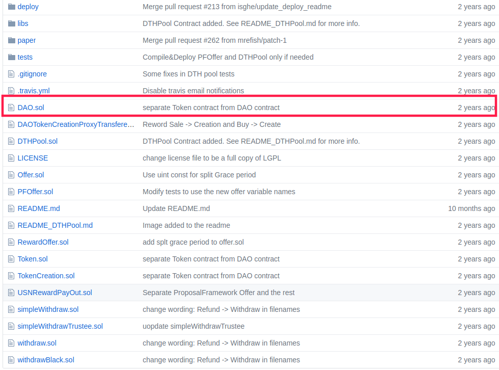

# Project1：Oyente

## 简介

 Oyente是一个基于符号执行的智能合约漏洞检测工具。本次实验的主要目的是搭建Oyente的实验环境，尝试使用Oyente对智能合约进行漏洞检测，并从代码层面分析Oyente的设计与实现。

 项目地址：`https://github.com/melonproject/oyente`

## 实验环境

实验环境采用如下的软硬件配置：
- 硬件：Intel i7 8550U/16GB RAM
- 操作系统：Ubuntu 18.04 LTS
- 解释器：Python 2.7.14

搭建依赖环境：

1. 安装solidity编译器solc
```
$ sudo add-apt-repository ppa:ethereum/ethereum
$ sudo apt-get update
$ sudo apt-get install solc
```

2. 安装evm虚拟机
```
$ sudo apt-get install software-properties-common
$ sudo add-apt-repository -y ppa:ethereum/ethereum
$ sudo apt-get update
$ sudo apt-get install ethereum
```

3. 安装z3约束求解器

Download the [source code of version z3-4.5.0](https://github.com/Z3Prover/z3/releases/tag/z3-4.5.0)

```
$ python scripts/mk_make.py --python
$ cd build
$ make
$ sudo make install
```

4. 安装python库
```
pip install requests
```

## 使用与测试
Oyente的使用方法很简单，提供给用户的接口就是oyente.py文件。基本的使用方法如下：

- 测试本地的合约文件

    > `python oyente.py -s <contract filename>` 

- 测试远程的合约文件
    > `python oyente.py -ru https://gist.githubusercontent.com/loiluu/d0eb34d473e421df12b38c12a7423a61/raw/2415b3fb782f5d286777e0bcebc57812ce3786da/puzzle.sol`


### 测试本地合约代码

1. 在oyente/oyente下新建一个source_code目录，并从github下载[the Dao代码](https://github.com/slockit/DAO)。合约代码的目录如下所示，我们等下就要测试其中的DAO.sol文件。


2. 进入到oyente/oyente目录，运行以下命令进行漏洞检测
> `python oyente.py -s ./source_code/DAO/DAO.sol`

检测结果如图所示，我们看到oyente成功检测到了两个合约中的整数溢出漏洞。这两个合约分别是DAO.sol和其所依赖的TokenCreation.sol文件。


### 测试远程合约代码

运行以下代码，可以对远程的一个合约文件进行检测。
> `python oyente.py -ru https://gist.githubusercontent.com/loiluu/d0eb34d473e421df12b38c12a7423a61/raw/2415b3fb782f5d286777e0bcebc57812ce3786da/puzzle.sol`

运行结果如图，可以看到oyente检测出了两个合约漏洞。


## 代码分析

### *oyente.py*

oyente的入口函数，其可以通过接收以下类型的输入来分析智能合约：
- solidity合约代码
- evm字节码
- 网络上的远程合约代码

其他配置选项包括获取输入状态，设置z3的超时等，这些选项被整理并设置在global_params模块中。如果输入的是合约，oyente将使用```evm disasm```命令将其进一步翻译为字节码。最后，由 *symexec*模块来对合约进行符号执行和漏洞分析。

### *symExec.py*

分析从函数*build_cfg_and_analyze()*开始，并使用python原生的tokenize模块对二进制文件进行分割。*collect_vertices* 和 *construct_bb*函数用于识别程序中的基本块，并以图的形式记录。基本块的识别主要是用过查找```JUMPDEST```、 ```STOP```、 ```RETURN```、 ```SUICIDE```、 ```JUMP``` 和 ```JUMPI```等跳转指令。每个基本块都是一个*BasicBlock*实例，这个对象定义在*Basicblock.py*中。

在创建基本块之后，用*full_sym_exec*函数符号化地执行每个基本块。执行的过程为获取每个基本块中的指令，并通过*sym_exec_ins*函数依次模拟执行。在这个函数中，作者每个操作码与在以太坊黄皮书中描述的行为进行了模拟实现。

# Project2：Hyperkernal1

## 简介
 
项目地址：https://github.com/chyyuu/hv6

## 实验环境

实验环境采用如下的软硬件配置：
- 硬件：Intel i7 8550U/16GB RAM
- 操作系统：Ubuntu 18.04 LTS

搭建依赖环境

1. 安装LLVM

## 运行测试

当前问题：make hv6-verify出错